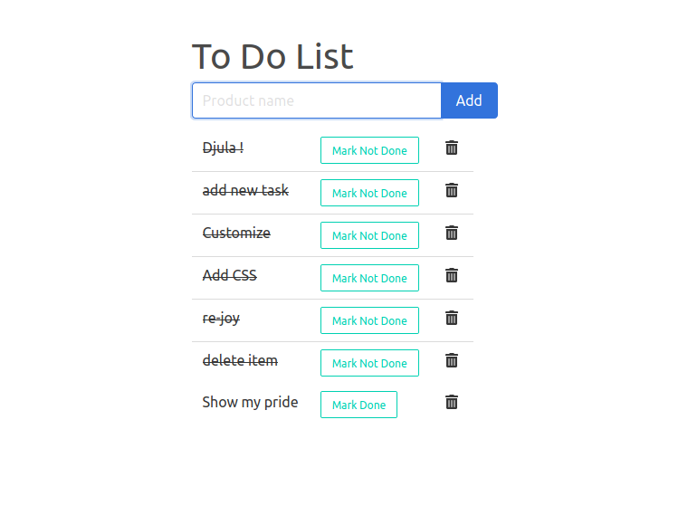

# ISSR-TODO app: a dynamic todo-app without a line of JavaScript

[http://cjackson.tk/todo-tutorial](http://cjackson.tk/todo-tutorial)

Overview: https://github.com/interactive-ssr/client/blob/master/main.org

> What makes ISSR unique is its lack of any kind of client-side programming. Other Server based frameworks allow you write what would normally be written in Javascript onto the server. ISSR goes a step further into the land of declarative programming by moving any interactive changes into the realm of HTML generation (rather than DOM manipulation). The web developer only needs to know HTML and the server-side programming language (and CSS if you want styles); No knowledge about Javascript or DOM is necessary.

## Demo

I did the todo-app again, but with Djula templates (Django-like templates, although more flexible, it's Lisp).

It's time to envision serious things with this library.

This is interactive as we expect:

## Usage

load issr-test.asd (C-c C-k)

(ql:quickload "issr-test")

Access http://localhost:8080/products

See also: https://github.com/dbohdan/liveviews

### Remarks

- We can't update little parts of the DOM. That is not the philosophy of ISSR.
- How to add transitions on added elements? It seems difficult (it's possible in JS. htmx has workarounds for this).

## See also:

- https://htmx.org/ - similar in scope. We can update precise parts of the DOM, built-in transitions support…
